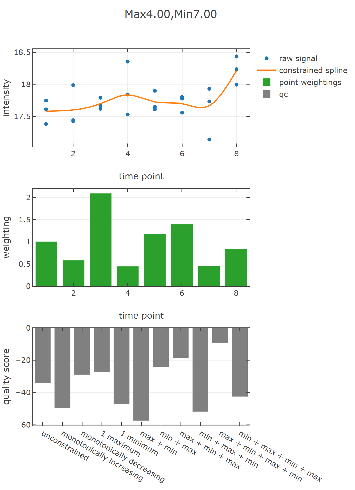

## Temporal classification

Temporal classification is an approach conceptually based on a classical time series analysis, where the dependency of the consecutive time points is exploited. 
Constrained smoothing splines with automated model selection separates between signal and noise under the assumption that high frequent changes are less likely 
to occur, simultaneously preserving information about the detected variance. 
This enables a more precise representation of the measured information and improves temporal classification in order to 
identify biologically interpretable correlations among the data. 


## Usage:

```fsharp
#r "TempClass.dll"
#r "FSharp.Stats.dll"
#r "nuget: Plotly.NET, 4.2.0"
#r "nuget: FSharp.Collections.ParallelSeq, 1.2.0"

open FSharp.Stats
open Plotly.NET
open TempClass
open TempClass.TemporalClassification
open Plotly.NET

FSharp.Stats.ServiceLocator.setEnvironmentPathVariable (@"\..\TempClass\lib")
FSharp.Stats.Algebra.LinearAlgebra.Service()


// time points with spacing according to kinetic expectation
let timepoints = vector [|1.;2.;3.;4.;5.;6.;7.;8.|]

// three replicates where measured at each of the 8 time points
let intensitiesProteinA = 
    [|
        [|17.74781999; 17.60999355; 17.3816851|];
        [|17.44109769; 17.42662059; 17.98721015|];
        [|17.79075992; 17.6181864; 17.66741748|];
        [|17.53004396; 18.35447924; 17.84085591|];
        [|17.90062327; 17.65002708; 17.60924143|];
        [|17.77776007; 17.80117604; 17.55941645|];
        [|17.1401598; 17.73320743; 17.93044716|];
        [|18.43547806; 18.23607406; 17.99477221|]
    |]

// Time point weighting method
let weighting = Fitting.WeightingMethod.StandardDeviation

// Minimization criterion for the final model selection. Shapebased optimization is carried out using mGCV
let minimizer = Fitting.Minimizer.AICc

// smoothing spline result
let (result,modelQualityScores) = Fitting.getBestFit timepoints intensitiesProteinA weighting minimizer

// used smoothing strength
let lambda = result.Lambda //226.44802


// classification decription of the signal. If the intensities do not exceed a range of 0.05, they are classified as constant signals
// alternatively, ANOVA filtering can be applied
let classification = Classification.getClassification timepoints result.TraceA result.TraceC 0.05 1.

// function that takes a x vale and returns the predicted y value of the constrained smoothing spline
let splineFunction : float -> float = result.SplineFunction

let visualizationSpline = 
    TemporalClassification.Vis.getChart result (Some modelQualityScores)

visualizationSpline
|> Chart.show

```

## Charting result



## References

- Anderson E. et al., 1999, LAPACK Users' Guide, Society for Industrial and Applied Mathematics, Philadelphia, PA, 3rd Edition, 0-89871-447-8
- Wood SN., 1994, Monotonic smoothing splines fitted by cross validation, SIAM J. Sci. Comput., Vol. 15, No. 5, pp. 1126-1133
- Turlach B., 1997, Constrained Smoothing Splines Revisited, The Australian National University, Canberra ACT 0200
- Meyer MC., 2012, Constrained penalized splines, The Canadian Journal of Statistics, Vol. 40, No. 1, pp. 190–206

# Development

_Note:_ The `release` and `prerelease` build targets assume that there is a `NUGET_KEY` environment variable that contains a valid Nuget.org API key.

### build

Check the [build project](https://github.com/bvenn/TempClass/blob/main/build) to take a look at the  build targets. Here are some examples:

```shell
# Windows

# Build only
./build.cmd

# Build and create nuget package
./build.cmd pack

# Full release buildchain: build, test, pack, build the docs, push a git tag, publish the nuget package, release the docs
./build.cmd release

# The same for prerelease versions:
./build.cmd prerelease


# Linux/mac

# Build only
build.sh

# Build and create nuget package
build.sh pack


# Full release buildchain: build, test, pack, build the docs, push a git tag, publísh the nuget package, release the docs
build.sh release

# The same for prerelease versions:
build.sh prerelease

```